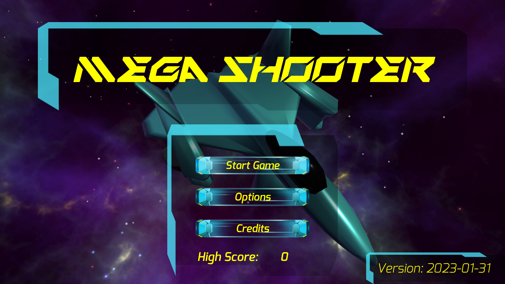

# MegaShooter



Unity project based on Space Megaforce

Design notes:
https://app.milanote.com/1PmxcB10Noab9s/megashooter

## Testing
To run a WebGL build:
1. Configure Unity so that the build has no compression
2. Run a local web server:
```
python3 -m http.server
```
3. Open the local address in a browser

## Resources:

### Music
- https://aeronmusic.newgrounds.com/audio

### Sound FX
- https://freesound.org/

### Fonts
- http://www.fontsquirrel.com/
- http://www.dafont.com/

### Particles
- http://www.kenney.nl

## TO DO

- [x] Boss scene
- [ ] Ad another state for the Boss when HP is less than 25. Make it faster.
- [ ] Add more patterns to boss attacks
- [ ] Add a checkpoint to finishing the first stage
- [ ] Integrate boss into the first stage
- [ ] Design a clear structure for the first stage
- [ ] Add more complex enemies during the stage (Some which shoot back)
- [ ] Add another stage

## Authors
- [Gilberto Echeverria](https://github.com/gilecheverria)
